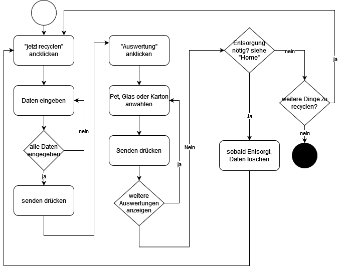

# Reasycle
Quelle für Inhaltsverzeichnis: https://www.ionos.de/digitalguide/websites/web-entwicklung/readme-datei/
https://github.com/FriendsOfREDAXO/markitup/blob/master/plugins/documentation/docs/de_de/howto_markdown.md#anker

### Inhaltsverzeichnis
1. [Inhalt des Projektes](#inhalt-des-projektes)
2. [Vorgehen](#vorgehen)
3. [Technologien](#technologien)
4. [Funktionen](#funktionen)
5. [Ablaufdiagramm](#ablaufdiagramm)
6. [Selbstrefelxion](#selbstreflexion)
7. [Infos zur Anwendung](#anwendung)
8. [FAQs](#faqs)

### Inhalt des Projektes
***
Bei diesem Projekt geht es um eine Webapp. Die Webapp soll mit Pycharm programmiert werden. 
Es geht dabei darum, verschiedenen Programmiersprachen einzusetzten und erste Erfahrungen mit Pycharm zu sammeln. 
Meine Idee für das Projekt ist es eine Webapp zu programmieren, mit welcher man 
sein Recyclingverhalten überwachen kann. Ausserdem sollte die Entsorgung des Altglas, PET und co. erleichtert werden. 

### Vorgehen
***
Die Installation der verschiedenen Programme war der erste Schritt. Danach erstelle ich ein Github Profil. Weiter mussten ich das Wissen für die verschiednen Programme erlernen. Nachdem ich Kenntnisse darüber hatte, konnte ich die Webapp nach und nach programmieren. 

### Technologien
***
1. Pycharm, Version 2021.3.2
2. Flask
3. Plotly
4. Pandas

### Funktionen
***
1. Eingabe der täglichen Menge an Altglas, PET und Karton
2. Auswertung wie viel entsorgt wurde
3. Berechnung wie viel C02 gespart wurde
4. Erinnerung auf dem Bildschirm, wann entsorgt werden muss (bei Glas ist dies der Fall, wenn es
über 20 Flaschen sind, bei Pet ebenso und bei Karton, wenn über 1000 Gramm Karton vorhanden sind)

### Ablaufdiagramm
***

Die zwei Menüpunkte "Co2 sparen" und "Statistik" werden nur zur 
Veranschaulichung verwendet und sind nicht Teil des eigentlichen 
Ablaufes. Somit sind diese nicht im Flussdiagramm
enthalten. 

### Selbstreflexion
***
Zum Start des Projektes hatte ich Schwierigkeiten zu starten. Es ging eine Weile 
bis ich mich mit der Materie auseinanderzusetzen wagte. Als ich aber einmal gestartet
hatte, ging es kontinuierlich voran. Durch Internetrecherche und durch hilfreiche
Inputs der Dozenten nahm das Projekt nach und nach Form an. Im Laufe des Projektes
fing ich auch an die Zusammenhänge zu verstehen und das Ganze machte immer mehr Sinn. Ich denke,
mein Zeitmanagement war nicht so schlecht in diesem Projekt. Jedoch denke ich, für
das nächste Mal würde ich doch früher starten, den Programmierung ist immer noch
sehr aufwändig und braucht somit mehr Zeit als vielleicht am Anfang gedacht. Was am Schluss leider 
nicht mehr geklappt hat, ist eine "ResetFunktion" für die Daten der Json Liste einzubauen. Man muss
die Daten nun einfach noch manuell in der daten2.json löschen. Im Grossen
und Ganzen bin ich sehr zufrieden mit dem Endergebnis und mit dem Learning, die ich 
aus dem Projekt ziehen konnte. 

### Infos zur Anwendung 
***
Bei der Anwendung gib es noch einige Dinge, die nicht so funktionieren, wie eigentlich geplant. 
Zum Beispiel, wird das Diagramm angezeigt, jedoch mit einer Eingabe Verzögerung. 
Das heisst, wenn ich eine Summe habe Pet: 10, Glas: 10 und Karton: 400 habe. Dann gebe ich im Formularfeld 5x Pet ein, dann 
zeigt es immer noch die Summe Pet: 10, Glas: 10 und Karton: 400 an. Erst wenn ich nochmals etwas eingebe(z.B. 100 Gramm Karton) im 
Formularfeld, werden die 5x Pet in das Diagramm übernommen. Da die Rechnung von Daten und die Datenspeicherung zur gleichen Zeit erfolgt, kann die aktuellste Summe nicht direkt 
ins Diagramm einfliessen. Dies konnte ich auch durch viele Versuche nicht beheben. 

### FAQ's
***

####Frage 1: Wo kann ich meine Angaben zum Recycling eingeben?
Die Daten zum recycling können unter der Lasche "jetzt Recyclen" eingegeben werden. 
####Frage 2: Wie wird berechnet wie viel Co2 gespart wurde?
Es wurden Daten zu C02-Ersparnis aus einer Internetrecherche genommen. Diese Daten sind
Richtwerte, welche auch abweichen können. Je nach Grösse kann es Abweichungen geben. Es wurde
ein Durchschnittswert genommen. 
####Frage 3: Wiso kann ich keine Dosen recyclen?
Für diese Webapplikation hat sich der Entwickler für einige Funktionen entschieden. Diese
könnten aber ohne grosse Probleme ergänzt werden. 

